# Distillation
[Github仓库](https://github.com/0Jmins0/Distillation)


# TODO LIST
## 阶段一：项目初步构建
* 【已完成】数据集重构代码
* 【已完成】数据集类定义代码
* 【已完成/有疑问】MVCNN_CLIP 的模型定义代码
* 【已完成】训练代码
* 【已完成】评估代码
* 【已完成】其他（utils）
* 【已完成】整理代码
* 快速训练/测试脚本(jupyter-notebook)
* 可视化脚本(jupyter-notebook)
* 【已完成】具体的网络结构设计   
* 【已完成】具体的LOSS的设计
* 【已完成】学生模型定义
* 【已完成】教师模型定义
* 【已完成】蒸馏的损失函数
* 【已完成】蒸馏的训练代码
* 【已完成】初步实验效果
## 阶段二：进一步修改
* 【2025.4.3】由 2D to 2D 改成 3D to 3D
* 【2025.3.30】数据集处理修改，负样本改成不同类别
* 【2025.4.7】测试变成3D
* 【2025.4.9】评测标准MAP
* 降低特征维度: 50 * 256 -> 4096
* 重新训练模型 num_views = 12
* 预训练尝试改成ImageNet1K
* CLIP在这个问题上表现一般，试试蒸SAM或者DINOv2
* 利用clip text文本

## 阶段三：实验
1. 四个数据集上的分别训练和测试（map、NDVG、ANMRR）
2. 重新分配MN40，为20可见，20不可见，重新训练模型，并分别看效果
3. 检索的视图数量减少为4 
4. 重新划分可见/不可见类别的比例并训练 
5. 跨数据集测试，使用MN40训练，ABO测试 
## 实验
1. 视图消融：用现有模型，改变检索测试时输入的视图数量
2. real and virtual：在MN40训练，在ABO检索 VS 在ABO训练，在MN40检索 
3. seen and unseen：重新划分mn40为20可见，20不可见，重新训练，分别看可见和不可见的效果
4. Cross-dataset：用现有模型（MN40core训练），在ABOcore上测试检索，
5. visualization：可视化


## 服务器
### 配置
* 型号
    GeForce RTX 3090 (24G)
* 系统镜像
    ```
    No LSB modules are available.
    Distributor ID: Ubuntu
    Description:    Ubuntu 20.04.6 LTS
    Release:        20.04
    Codename:       focal
    ```
* 带宽
    * 32 50kb/s
    * 100 2Mb/s 0.2/h
    * 200 22.8Mb/S 0.5/h  15min 17G
### 快捷搭建
```
git clone https://github.com/0Jmins0/Distillation.git
cd Distillation/
conda env create -f environment.yml

### 40min
sudo apt-get install aria2
aria2c -x 16 -s 16 http://pan.blockelite.cn:15021/web/client/pubshares/rCc6ewhu3MJw4aDFDwhe5E -o /data


wget -O /root/Distillation/data/ModelNet_random_30_final.zip "http://pan.blockelite.cn:15021/
web/client/pubshares/kA2TCzPGecYakeRkDARsBP?compress=false"

### 48min
wget -O /root/workspace/Distillation/data/OS-ABO-core.zip "http://pan.blockelite.cn:15021/web/client/pubshares/UPJ3T59vYbr9DM6xiBkGcB?compress=false"
### 下载中断，可继续
wget -c -O /root/Distillation/data/ModelNet_random_30_final.zip "http://pan.blockelite.cn:15021/web/client/pubshares/MhwSJSPtbxtBuR26myvRtg?compress=false"
### 查看是否下载完成
tail -n 10 nohup.out

mkdir -p /root/Distillation/data/model40_180
unzip /root/Distillation/data -d /root/Distillation/data/model40_180

unzip /root/Distillation/data/OS-ABO-core.zip -d /root/Distillation/data/OS-ABO-core

conda activate Distillation
cd src

python rebuild_dataset.py
python train.py

git add src output README.md pre.md
git config --global user.name "HiHi"
git config --global user.email "3234252073@qq.com"

git add src
git add models/train_models/base/MVCNN_CLIP/tensorboard_logs/

git commit -m 'first'
git push
```

### 训练
```
nohup python train.py > train_output.log 2>&1 &

# 从头训练MV_AlexNet_dis

python train.py --model_name MV_AlexNet_dis --num_epochs 15 --model_num 0

nohup python train.py --model_name MV_AlexNet_dis --num_epochs 15 --model_num 0 --batch_size 16 >train_output_16.log 2>&1 &


nohup python feature_extraction.py --model_name MV_AlexNet_dis --model_num 14 --batch_size 8 &

nohup python evaluate.py --model_name MV_AlexNet_dis --model_num 14 --batch_size 8 &

# 监控loss变化
tensorboard --logdir=../output/tensorboard_logs
```


## 实验记录
### 01 (Clip layer12 + 3 * 线性层)
```python
def __init__(self, num_views = 12):
        self.net_1 = self.clip_model
        self.net_2 = nn.Sequential(
            nn.Linear(self.net_1.config.hidden_size, 1024),
            nn.ReLU(),
            nn.Dropout(0.3),
            nn.Linear(1024, 512),
            nn.ReLU(),
            nn.Dropout(0.3),
            nn.Linear(512, 256)
        )
       # 在 MVCNN_CLIP 的 __init__ 中解冻12层
        for name, param in self.net_1.named_parameters():
            if "vision_model.encoder.layers.12" in name:  # 解冻最后一层
                param.requires_grad = True
            else:
                param.requires_grad = False
```
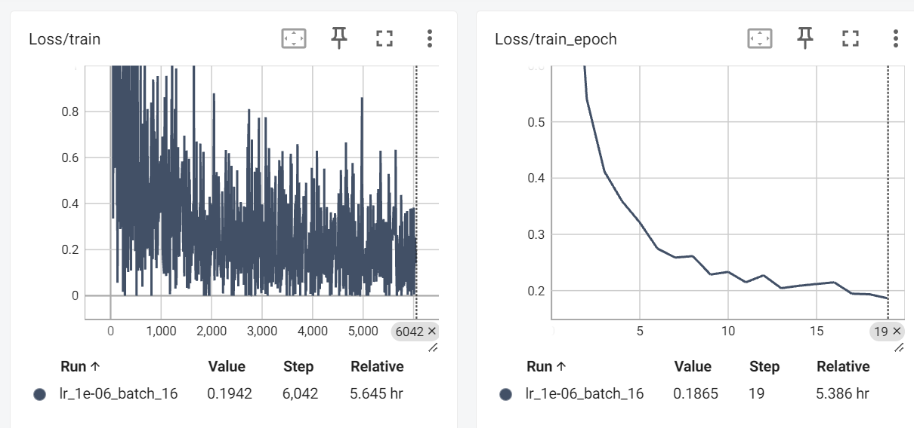
* 训练可见类别检索：

* 训练不可见类别检索：
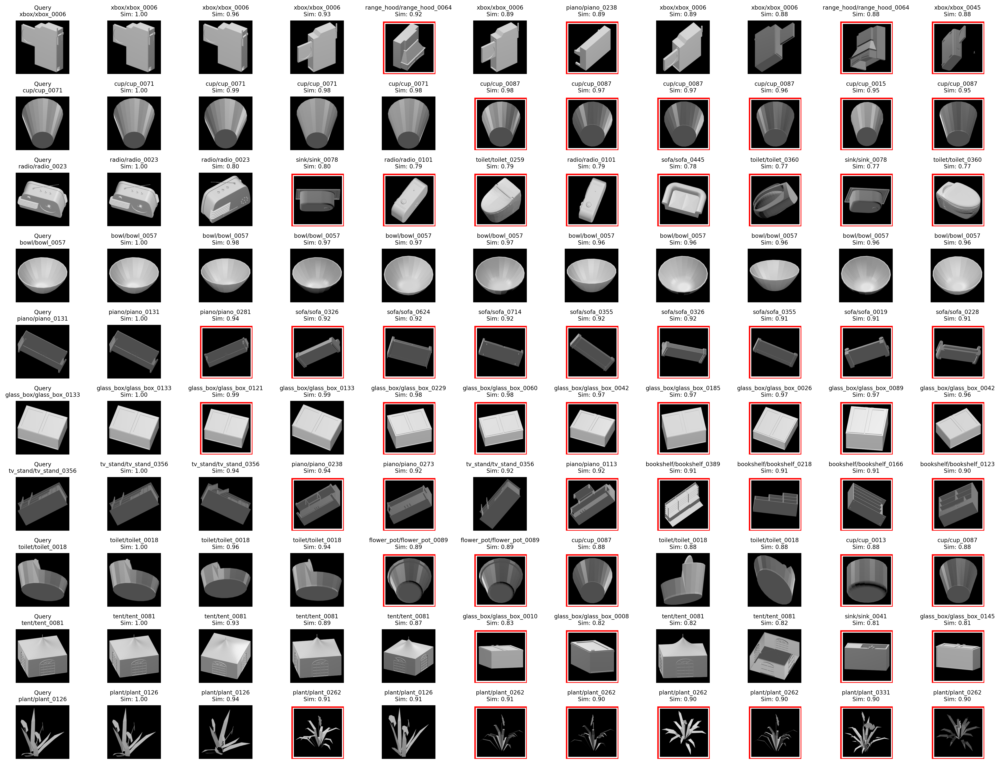


### 02 (Clip layer12 + 3 * 线性层)
```python
def __init__(self, num_views = 12):
        self.net_1 = self.clip_model
        self.net_2 = nn.Sequential(
            nn.Linear(self.net_1.config.hidden_size, 4096),
            nn.ReLU(),
            nn.Dropout(0.5),
            nn.Linear(4096, 4096),
            nn.ReLU(),
            nn.Dropout(0.5),
            nn.Linear(4096, 1024)
        )
       # 在 MVCNN_CLIP 的 __init__ 中解冻12层
        for name, param in self.net_1.named_parameters():
            if "vision_model.encoder.layers.12" in name:  # 解冻最后一层
                param.requires_grad = True
            else:
                param.requires_grad = False
```
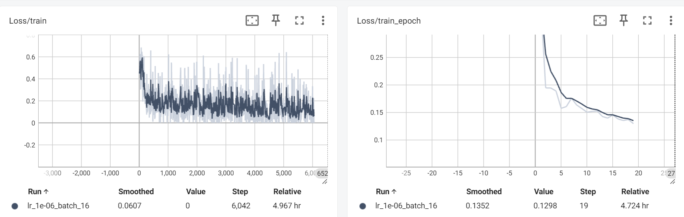
* 训练可见类别检索：
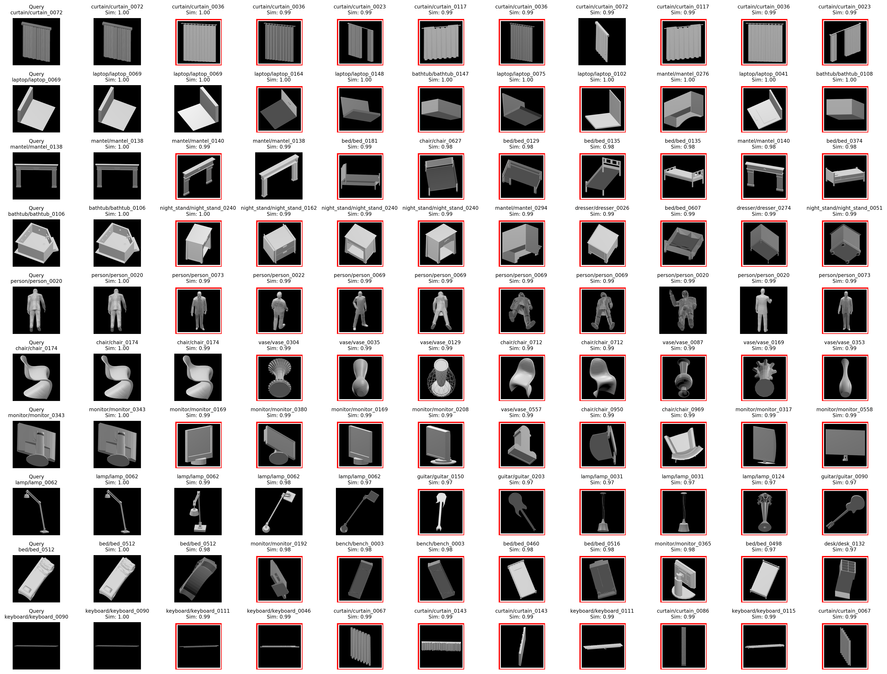
* 训练不可见类别检索：
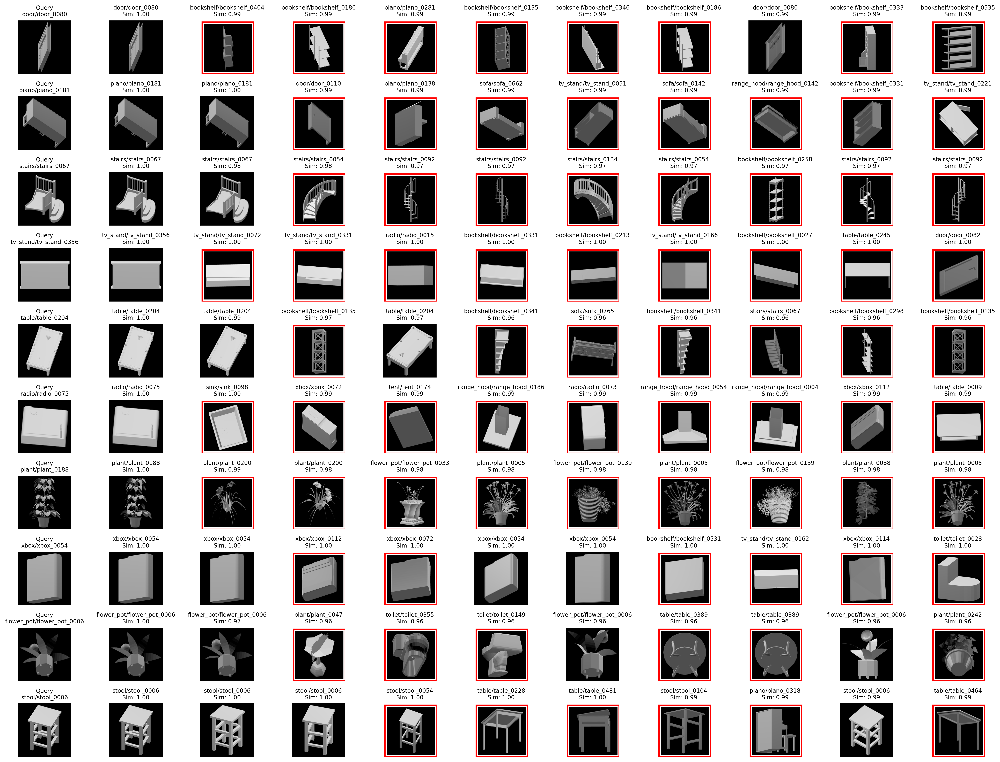


### 03 (CLIP layer12)
```python
def __init__(self, num_views = 12):
    super(MVCNN_CLIP, self).__init__()
    self.clip_model = CLIPVisionModel.from_pretrained("openai/clip-vit-large-patch14")
    self.clip_processor = CLIPProcessor.from_pretrained("openai/clip-vit-large-patch14")
    self.num_views = num_views

    self.net_1 = self.clip_model
    # 在 MVCNN_CLIP 的 __init__ 中解冻部分层
    for name, param in self.net_1.named_parameters():
        if "vision_model.encoder.layers.12" in name:  # 解冻最后几层
            param.requires_grad = True
        else:
            param.requires_grad = False
```

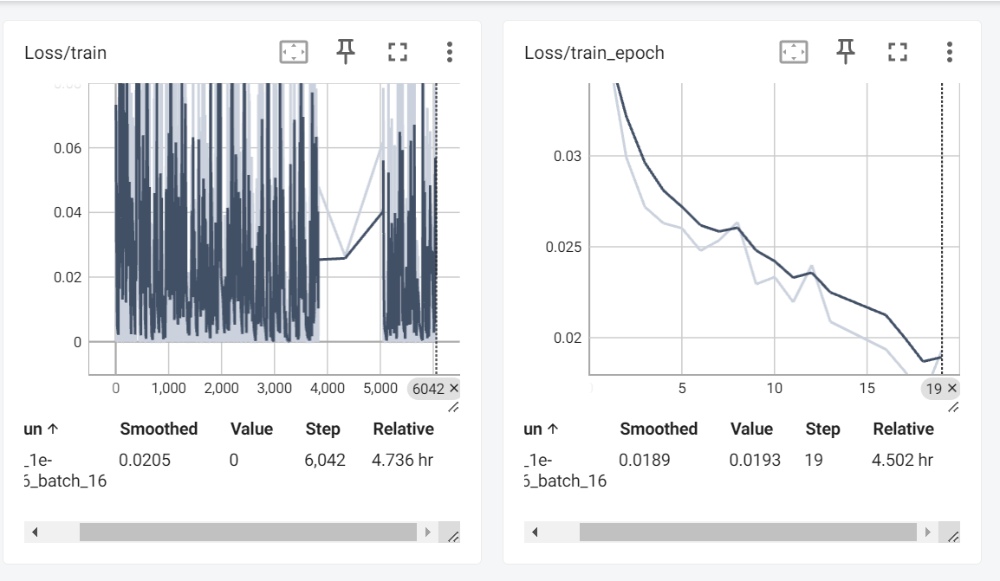

* 训练可见类别检索：
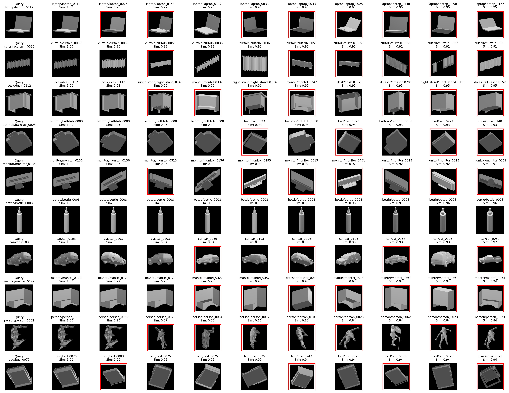
* 训练不可见类别检索：
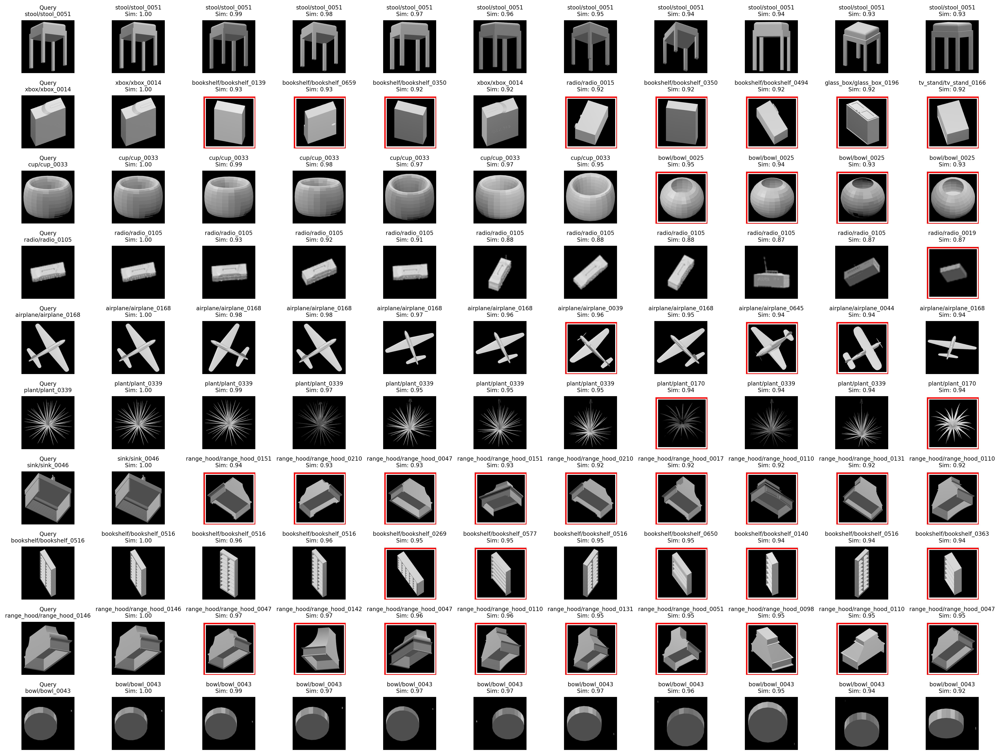

### 04 (MVAlexNet)
```python
base_model = torchvision.models.alexnet(pretrained = pretrained)
# 加载预训练的alexnet模型
self.feazture_len = 4096
# 设置特征长度为4096
self.features = base_model.features
self.fc_features = nn.Sequential(
    nn.Dropout(),
    nn.Linear(self._get_conv_output_size(), 4096),  # 224x224输入时，特征图尺寸为6x6
    nn.ReLU(inplace=True),
    nn.Dropout(),
    nn.Linear(4096, 4096),
    nn.ReLU(inplace=True)
)
self.fc = nn.Linear(self.feature_len, 1024)
```
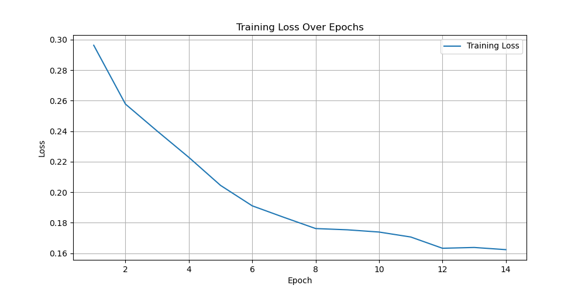

* 训练可见类别检索：
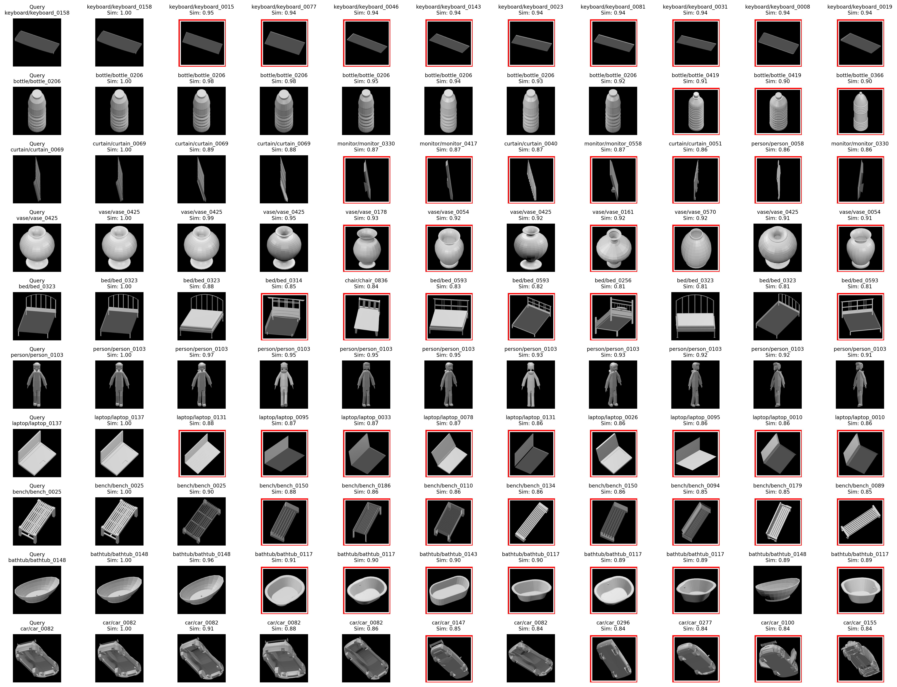
* 训练不可见类别检索：
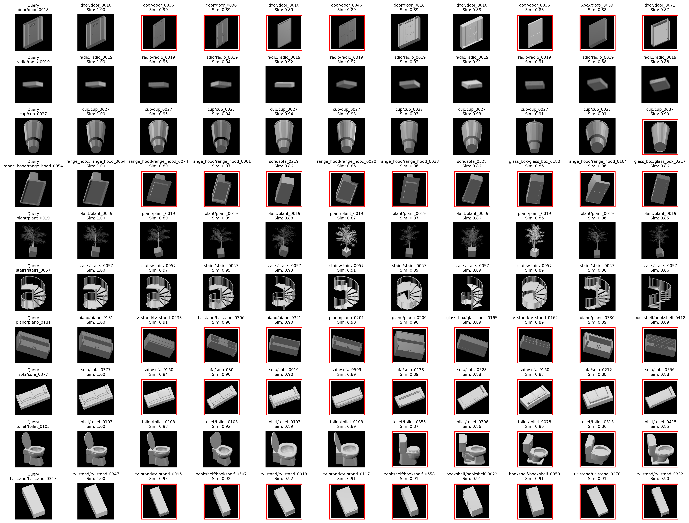

# 网络结构和LOSS

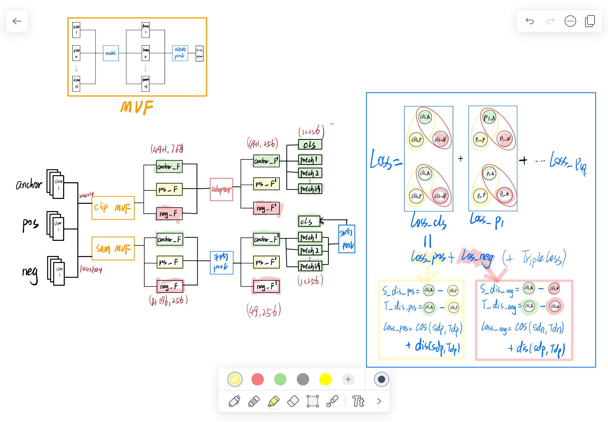

# 问题设定
多视图的特征学习（CLIP->关系蒸馏到CLIP里）+ 图像检索
# Q & A
1. 搭建baseline
   * 多视图特征学习
     * Q: 现在是如何提取和融合多视图的特征的，怎么操作？用的什么网络？
       * A: 多视图分类，其中输入数据包含多个视图或来源，旨在基于这些多个视图对样本的标签进行分类或预测。
       * A: **使用 ``MVCNN`` 的结构，将其中的 ``CNN1`` 替换成 ``CLIP``,后接视图池化层，再接一个 ``CNN2`` 输出最终的特征**
    * Q: 前向传播维度的更改，前后没有改变，为什么要这样操作？？？？
        ```python
        x = x.view(-1, self.num_views,C, H, W)
        # 调整维度顺序，将视图维度（num_views）移到通道维度（C）之后，然后将张量重新整形为(N * num_views, C, H, W)。
        # 这样，每个视图都被视为一个独立的图像样本。?????????
        x = x.permute(0,2,1,3,4).contigugous().view(-1, C, H, W)
        ```

   * 图像检索
     * Q: 输入：单张图片？一组多视图？
       * A:单张图片
     * Q: 分类的目标是输出label判别对错，检索的目标是什么？如何求loss？
       * A: 分为：实例级别、种类级别，这次使用**实例级别**
       * A: 还是分类任务，多使用 **三元组损失** 
     * Q: 如何同时考虑实例和分类的
       * A: 考虑 LOSS = 三元组损失
2. 替换蒸馏模型


# 快速使用
1. 调用 `remain_30` 函数，将 $180$ 张视图随机保留 $30$ 张
2. 运行 `rebuild_dataset.py`，将原本数据集重构成如下结构
    ```
    dataset_final/
        DS/
            train/
                class1/
                    instance1/
                    instance2/
                class2/
                    instance1/
                    instance2/
                ...
            retrieval/
                class1/
                    instance3/
                    instance4/
                class2/
                    instance3/
                    instance4/
                ...
        DU/
            train/
                class21/
                    instance1/
                    instance2/
                class22/
                    instance1/
                    instance2/
                ...
            retrieval/
                class21/
                    instance3/
                    instance4/
                class22/
                    instance3/
                    instance4/
                ...
    ```
3. 打包环境,生成 `requirements.txt`
    ```
    (Distillation) root@34760283bb8e:/workspace/Distillation# pipreqs --force
    ```
4. 创建环境 `conda env create -f environment.yml`


# 无用的东西
## 数据集
  * 180多，随机/选取 30个
  * 压缩17G，解压后1.57T，想办法传上去
  * 切分数据集为已知类别 (``DS``) 和未知类别 (``DU``)各20类，再分别切分成训练集(``DtSr/DtUr``)和检索集(``DrSe/DrUe``),使用``DtSr``训练，分别在``DrSe/DrUe``上测试
  * 标签
    * ```
      图像A（类别1，实例1，视图1）与图像B（类别1，实例1，视图2）：标签为1。
      图像A（类别1，实例1，视图1）与图像C（类别1，实例2，视图1）：标签为0。
      ```
```
数据集/
    类别1/
        实例1/
            视图1.jpg
            视图2.jpg
            ...
        实例2/
            视图1.jpg
            视图2.jpg
            ...
    类别2/
        实例1/
            视图1.jpg
            视图2.jpg
            ...
        实例2/
            视图1.jpg
            视图2.jpg
            ...
```


## STEP 1 特征提取

### 数据集 ModelNet40_180
**描述：** 有 $a$ 个类别，每个类别有 $b_i$ 个实例，每个实例有 $180$ 张视图

**特征提取：**
1. 每张视图提出一个一定规格的矩阵 $A_i$
2. 将每个矩阵 $A_i$ 压缩成一个 $(x,)$ 的一维向量，得到 $180$ 个特征向量
3. 将 $180$ 张视图的特征向量取均值，得到一个 $(x,)$ 的特征向量
4. 最终合并每个实例、每个类别，得到 $(x , a , b)$ 规格的特征矩阵


||CLIP|SAM|DINOv2|
|----|----|----|----|
|modele|ViT-B/32|ViT-L|dinov2_vits14|
|Input_Size|(224,224)|(1024,1024)|(1024 // 14 * 14, 1024 // 14 * 14)|
|特征|encode_image|image_encoder|x_prenorm(归一化之前的特征)|
|Output_Size_Before|(180, 512)|(180, 256, 64, 64)|(180, 5330, 384)|
|Output_Size_Mean_Flatten|(512,)|(1048576,)|(2046720,)|
|Output_Size_After(每个类别目前只传了3个实例)|(3, 512)|(3,1048576)|(3, 2046720)|
|range(肉眼看)|(-1e-1,1e-1)|(-1e-2,1e-2)|(-1e-1,1e-1)|

**Q:**
* 每个模型都有好多，S/B/L，该如何选择 **（选小的）**
* 对于每一个模型，具体应该提取哪一部分特征，是需要边做边实验哪个好嘛 **（输出层）**
* 多视图的目的
* 关系的表示

## STEP 2 搭建 baseline
任务目标：图片分类，超过教师模型

通过多视图的特征提取，抓取不同角度的关系，提高分类精度


