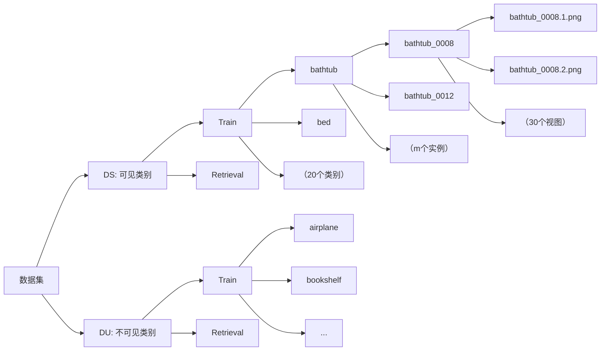
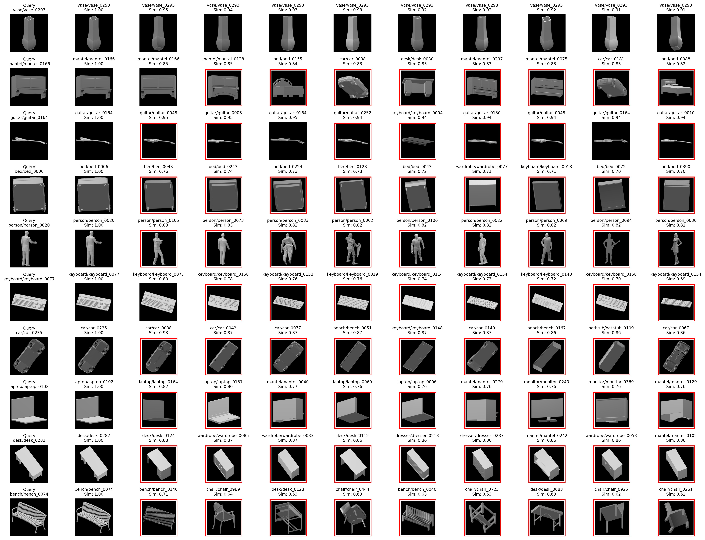
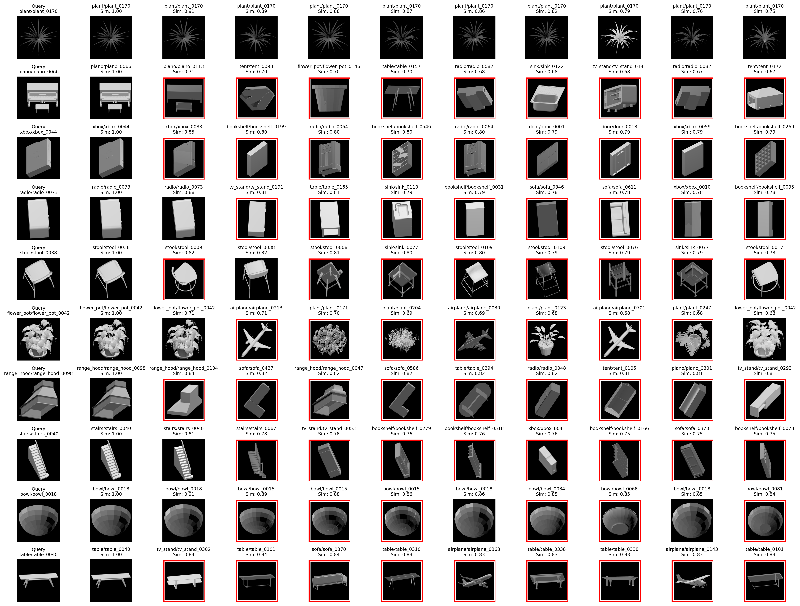
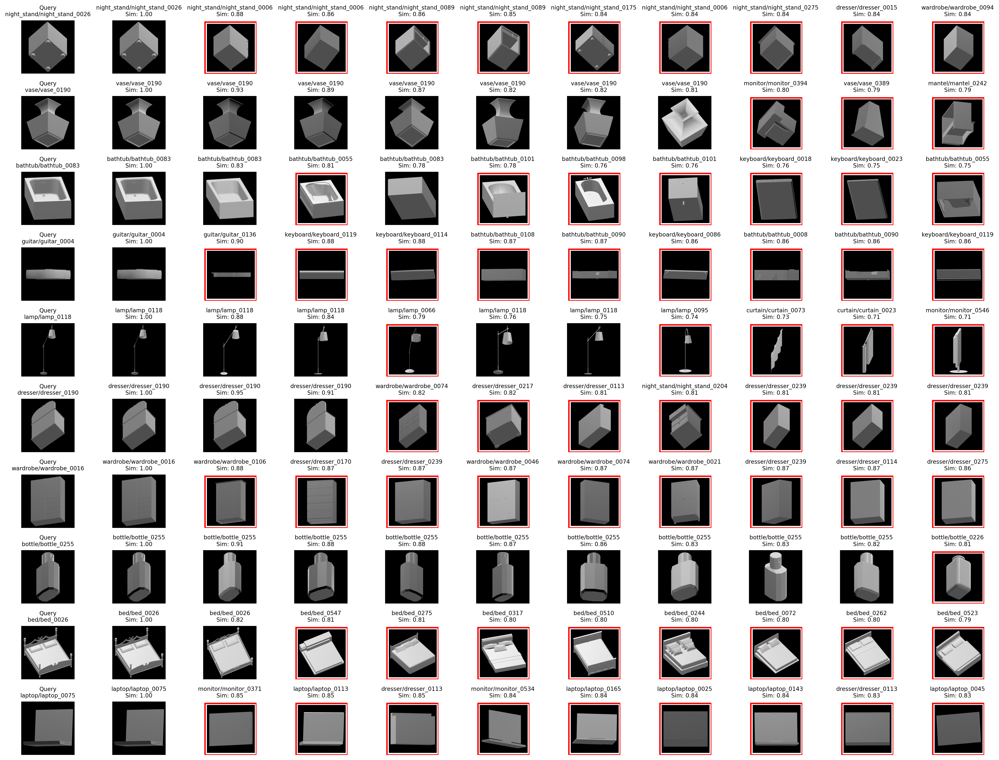

| Model               | OS-MN40-core | OS-ESB-core | OS-NTU-core |OS-ABO-core |
|---------------------|--------------|-------------|-------------|-------------|
| MVCNN_CLIP （微调CLIP）         | 0.7017       | 0.5209      | 0.5081      |0.6919      |
| MV_AlexNet（预训练）          | 0.5873       | 0.4822      | 0.3743      | 0.5833      |
| MV_AlexNet_dis_Pre （基于CLIP蒸馏） | 0.6824       | 0.5306      | 0.4420      | 0.6875      |
| HGM2R  （论文）             | 0.6420       | 0.5174      | 0.4488      | 0.6339      |

### MAP：
| Model                | OS-ABO-core   | OS-MN40-core | OS-ESB-core | OS-NTU-core |
|:---------------------|:--------------|:-------------|:------------|:------------|
| MVCNN_CLIP(B/32)     | 0.4398        | 0.4694       | 0.4442      | 0.3908      |
| MV_AlexNet           | 0.3348        | 0.3575       | 0.3423      | 0.2416      |
| MV_AlexNet_dis_Pre   | 0.4148        | 0.4309       | 0.3783      | 0.2893      |
| **HGM²R**            | **0.6339**    | **0.6420**   | **0.5174**  | **0.4488**  |

### FULL
| Model                | Train Dataset   | mAP     | ndcg@100 | anmrr   |
|:---------------------|:----------------|:--------|:---------|:--------|
| **HGM²R**            | **OS-ABO-core** | **0.6339** | **0.5796** | **0.3796** |
| MVCNN_CLIP           | OS-ABO-core     | 0.4398  | 0.4850   | 0.5609  |
| MV_AlexNet           | OS-ABO-core     | 0.3348  | 0.3716   | 0.6548  |
| MV_AlexNet_dis_Pre   | OS-ABO-core     | 0.4148  | 0.4641   | 0.5821  |
| **HGM²R**            | **OS-MN40-core** | **0.6420** | **0.7291** | **0.3827** |
| MVCNN_CLIP           | OS-MN40-core    | 0.4694  | 0.6131   | 0.5288  |
| MV_AlexNet           | OS-MN40-core    | 0.3575  | 0.4849   | 0.6306  |
| MV_AlexNet_dis_Pre   | OS-MN40-core    | 0.4309  | 0.5601   | 0.5644  |
| **HGM²R**            | **OS-ESB-core** | **0.5174** | **0.2273** | **0.5128** |
| MVCNN_CLIP           | OS-ESB-core     | 0.4442  | 0.2024   | 0.5837  |
| MV_AlexNet           | OS-ESB-core     | 0.3423  | 0.1665   | 0.6702  |
| MV_AlexNet_dis_Pre   | OS-ESB-core     | 0.3783  | 0.1801   | 0.6324  |
| **HGM²R**            | **OS-NTU-core** | **0.4488** | **0.2281** | **0.5667** |
| MVCNN_CLIP           | OS-NTU-core     | 0.3908  | 0.2049   | 0.6199  |
| MV_AlexNet           | OS-NTU-core     | 0.2416  | 0.1468   | 0.7536  |
| MV_AlexNet_dis_Pre   | OS-NTU-core     | 0.2893  | 0.1664   | 0.7062  |

##  问题
图搜图：基于多视图训练集的、实例级别的、开放式的图像检索。
## 数据集

## 方法
蒸馏多个大模型到AlexNet中，目前尝试实现蒸馏CLIP到AlexNet中
## 模型和损失设计
### 多视图模块

### 模型

### 损失计算

## 效果

## train_views = 15

### 之前
| 序号 | Model                     | Top-1 Accuracy DS/DU |
|------|---------------------------|--------------------|
| 1    | MVCNN_CLIP（Teacher）     | 0.6775/0.6068               | 
| 2    | MV_AlexNet（Student）     | 0.5286/0.4557             | 
| 3    | MV_AlexNet_dis_Pre（Distillation） | 0.4934/0.4137             | 

### 对比不同模型 （dataset_views = 15, test_views = 15）
| 序号 | Model                     | Top-1 Accuracy DS/DU | Top-10 Accuracy DS/DU | mAP@100 DS/DU |
|------|---------------------------|----------------------|-----------------------|---------------|
| 1    | MVCNN_CLIP（768）                | 0.7400/0.6483        | 0.9488/0.8847         | 0.8142/0.7301 |
| 2    | MV_AlexNet （256）               | 0.6560/0.5430        | 0.9378/0.8605         | 0.7547/0.6502 |
| 4    | MV_AlexNet_dis_Pre（50*256）        | 0.8030/0.7335        | 0.9648/0.9265         | 0.8596/0.7997 |

### 对比不同 test_views(dataset_views = 15)
| 序号 | Model              | test_views | Top-1 Accuracy DS | Top-10 Accuracy DS | mAP@100 DS |
|------|--------------------|------------|-------------------|--------------------|------------|
| 1    | MV_AlexNet_dis_Pre | 1          | 0.2150            | 0.4683             | 0.3006     |
| 2    | MV_AlexNet_dis_Pre | 3          | 0.3534            | 0.6669             | 0.4594     |
| 3    | MV_AlexNet_dis_Pre | 5          | 0.6951            | 0.9249             | 0.7737     |
| 4    | MV_AlexNet_dis_Pre | 8          | 0.7892            | 0.9521             | 0.8502     |
| 5    | MV_AlexNet_dis_Pre | 10         | 0.8514            | 0.9789             | 0.9000     |
| 6    | MV_AlexNet_dis_Pre | 15         | 0.8030            | 0.9648             | 0.8596     |
| 7    | MV_AlexNet_dis_Pre | 30         | 0.9242            | 0.9969             | 0.9533     |

### 对比不同 num_views(dataset_views = 12)
| 序号 | Model                     | test_views | Top-1 Accuracy DS | Top-10 Accuracy DS | mAP@100 DS |
|------|---------------------------|-----------|-------------------|--------------------|------------|
| 1    | MV_AlexNet_dis_Pre        | 1         | 0.1994            | 0.4300             | 0.2734     |
| 2    | MV_AlexNet_dis_Pre        | 12         |0.6802            | 0.9171             | 0.7613     |

| 序号 | Model                     | num_views | Top-1 Accuracy DS | Top-10 Accuracy DS | map@100 DS |
|------|---------------------------|-----------|-------------------|--------------------|------------|
| 1    | MVCNN_CLIP                | 3         | 0.2596            | 0.5911            | 0.3634     |
| 2    | MVCNN_CLIP                | 5         | 0.5489            | 0.8608            | 0.6565     |
| 3    | MVCNN_CLIP                | 10        | 0.7475            | 0.9547            | 0.8239     |
| 4    | MVCNN_CLIP                | 15        | 0.7400            | 0.9488            | 0.8142     |
| 5    | MVCNN_CLIP                | 30        | 0.7936            | 0.9703            | 0.8582     |

| 序号 | Model                     | num_views | Top-1 Accuracy DS | Top-10 Accuracy DS | map@100 DS |
|------|---------------------------|-----------|-------------------|--------------------|------------|
| 1    | MV_AlexNet                | 3         | 0.3034            | 0.6529            | 0.4162     |
| 2    | MV_AlexNet                | 5         | 0.5356            | 0.8382            | 0.6399     |
| 3    | MV_AlexNet                | 10        | 0.6544            | 0.9398            | 0.7532     |
| 4    | MV_AlexNet                | 15        | 0.6560            | 0.9378            | 0.7547     |
| 5    | MV_AlexNet                | 30        | 0.7162            | 0.9586            | 0.8048     |

### 其他
| 序号 | Model                     | Top-1 Accuracy (DU) | Top-1 Accuracy (DS) |
|------|---------------------------|--------------------|--------------------|
| 1    | MVCNN_CLIP（CLIP微调）     | 0.6068             | 0.6775             |
| 2    | MV_AlexNet（直接训练）     | 0.4557             | 0.5286             |
| 3    | MV_AlexNet_dis（直接蒸馏） | 0.1711             | 0.2246             |
| 4    | MV_AlexNet_dis_Pre（基于2蒸馏） | 0.4137             | 0.4934             |

| 序号 | Model                     | Top-1 Accuracy DS/DU | Top-10 Accuracy DS/DU | map@100 DS/DU |
|------|---------------------------|----------------------|-----------------------|---------------|
| 1    | MVCNN_CLIP                | 0.2635/0.2334        | 0.5896/0.5014         | 0.3710/0.3229 |
| 2    | MV_AlexNet                | 0.2971/0.2449        | 0.6703/0.5372         | 0.4185/0.3414 |
| 3    | MV_AlexNet_dis_Pre        | 0.1392/0.1262        | 0.3450/0.2840         | 0.2081/0.1810 |

### 可视化
#### Loss

#### DS(不可见类别检索)

#### DU(可见类别检索)

#### 微调CLIP
DS:

DU:

#### AlexNet

